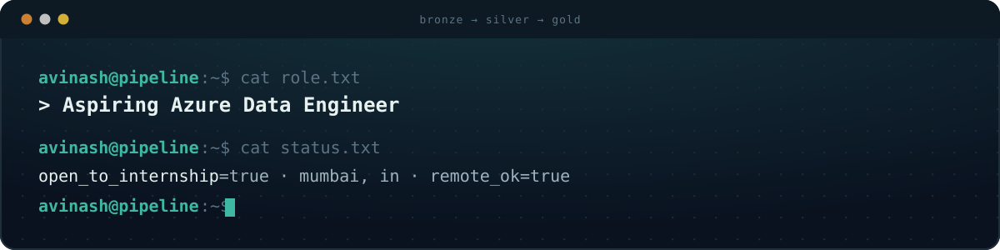

 

  
  &nbsp;
  
  &nbsp;
  

 

<table>
<tr>
<td width="60%" valign="top">

### 👋 About Me

I'm an **IT Engineering student** who builds **cloud-native data pipelines on Azure** — turning messy raw data into clean, trustworthy, query-ready datasets.

- 🎯 **Role I'm targeting:** Azure Data Engineer / Analytics Engineer / Cloud Data Intern
- 🏗️ **Focus:** ELT/ETL pipelines · Medallion Architecture · Lakehouse design
- ☁️ **Stack:** Azure Data Factory · Synapse Analytics · Databricks · PySpark · Delta Lake
- 💻 **Languages:** Python · Advanced SQL
- 🟢 **Status:** Open to Data Engineer / Analytics Engineer / Cloud Data internships
- 📍 **Location:** Mumbai, India · open to remote

 

---
## 🏗️ Featured Projects

<table>
<tr>
<td width="50%" valign="top">

### 🚕 RideStream — Uber Data Platform
**Real-time + batch Medallion pipeline on Azure**

- Combines real-time **Azure Event Hubs** streams with batch data using **Azure Data Factory** and **Databricks**
- Metadata-driven ingestion framework dynamically processes **7+ JSON mapping datasets**
- Processes **2,000+ ride records** end-to-end
- Dimensional model: **1 fact + 6 dimension tables**, using AUTO CDC Flow for **SCD Type 1 & 2** in Delta Lake

`ADF` `Event Hubs` `Databricks` `PySpark` `Delta Lake`

</td>
<td width="50%" valign="top">

### 🛒 DataForge — Commerce Data Platform
**CDC-driven Lakehouse for retail data**

- **CDC-based incremental ingestion** from PostgreSQL into a Databricks Lakehouse
- Processes **300K+ retail records** through Bronze → Silver → Gold layers
- **dbt-based Star Schema** Gold models for analytics-ready data
- Fully containerized **Docker** dev environment, orchestrated with **Airflow**

`Airflow` `Databricks` `dbt` `PostgreSQL` `Docker`

</td>
</tr>
</table>

*More Medallion Architecture projects in progress — check pinned repos for the latest ⬇️*

---

### 🧠 Tech Stack

<table> <tr>

<td valign="top" width="50%">

☁️ Azure Data Platform

       

⚡ Data Engineering

      

</td>

<td valign="top" width="50%">

💻 Programming & Databases

    

🔧 Data Tools & Platforms

      

📊 Data Libraries

   

</td>

</tr> </table>

---

  
  

  

